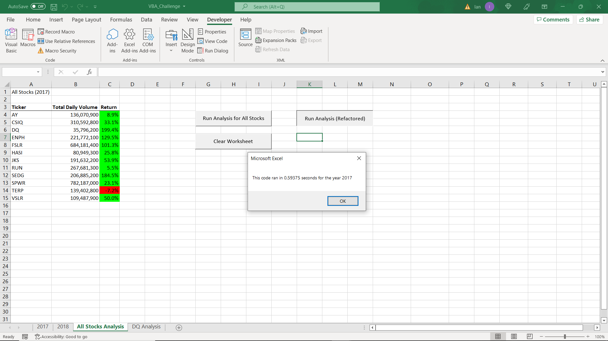
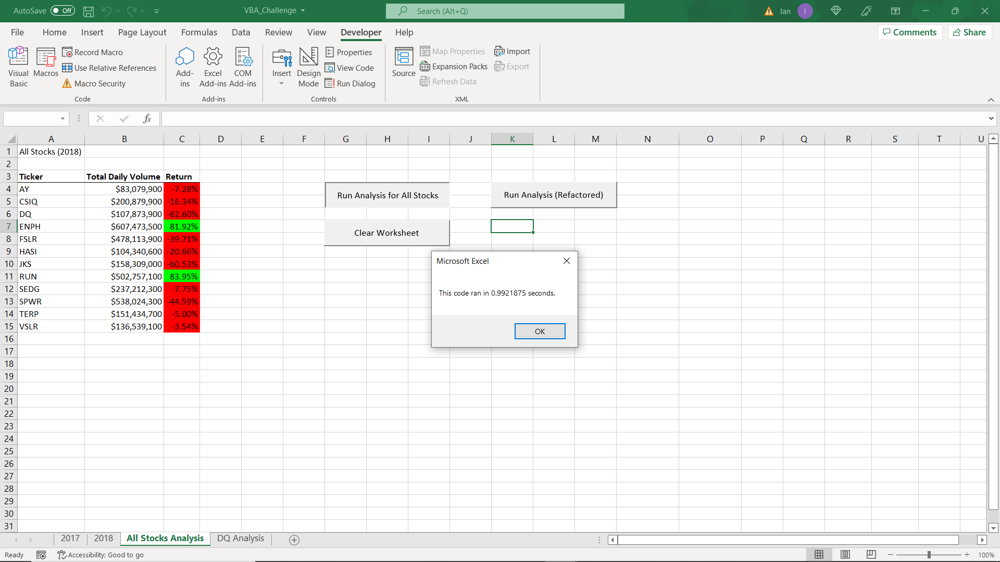
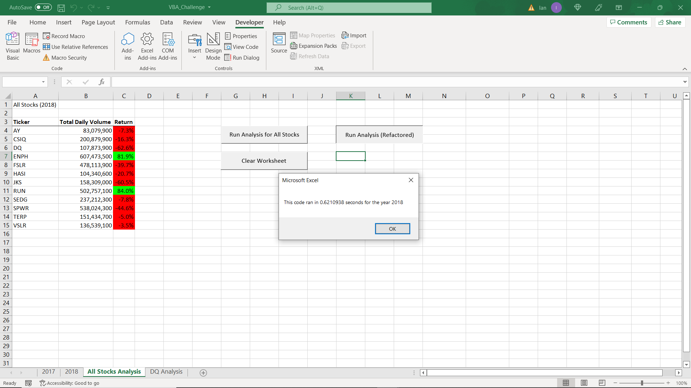

# Stock Analysis Using VBA

## Overview of Project

The goal of this project is to efficiently and effectively determine key information regarding various stocks related to green energy. This was accomplished using VBA Macros to gather information about the Annual Return Rate and Total Volume Traded for these stocks. The code was then refactored to run the program quicker and more efficiently.

## Results

### Analysis of 2017 Stocks

#### ORIGINAL VBA SCRIPT FOR 2017 STOCKS
/Original_VBA_2017.png)

#### REFACTORED VBA SCRIPT FOR 2017 STOCKS

Looking at the results from the 2017 stock performance it would appear that "DQ", "ENPH", "FSLR" and "SEDG" had the best performances in terms of Annual Return Rate. To find this annual return rate the final closing price of the year (from 12/29/17) was compared with the first closing price of the year (01/03/17). Each of the aforementioned stocks had a return of at least +100%, meaning the closing price on 12/29 had at least doubled its value in the 360 days in between. The results also show that the only analyzed stock to actually decrease in value at all was "TERP", which only decreased by -7.2%.

In terms of Total Volume of stocks traded, "FSLR" and "SPWR" were the two most commonly traded stocks, each having a volume of over 500 million stocks traded over the course of the year. These values were found by going iteratively through the table and adding the volume of daily traded stocks to the previously counted stocks for that company.

### Analysis of 2018 Stocks

#### ORIGINAL VBA SCRIPT FOR 2018 STOCKS
   

#### REFACTORED VBA SCRIPT FOR 2018 STOCKS

The results from the 2018 stock performance show a bleaker outlook than the previous years results. During this year the only two companies to profit at all were "ENPH" and "RUN". Both of these companies had a respectable +80% return rate, which is still a significant increase even though "ENPH" had previously achieved a +129.5% return in the previous year. Most companies by comparison had their stocks lose value in the 363 days that were recorded in 2018. A similar method was used to obtain these results, this time comparing the final closing price (12/31/2018) to the first closing price (01/02/2018).

In terms of Total Volume of stocks traded, "ENPH", "RUN" and "SPWR" were the most commonly traded stocks, all having a volume of over 500 million stocks traded over the course of the year. This volume in 2018 is a stark increase for both "ENPH" (an extra 400 million compared to 2017) and "RUN" (an extra 250 million compared to 2017). These values were again found by going iteratively through the table and adding the volume of daily traded stocks to the previously counted stocks for that company.

### Efficiency of Original Code Compared to Refactored Code
As can be seen in the pictures above, the refactored code was able to run quicker than the original code suggested by the readings in the module. For the 2017 code, the refactored version ran 1.28x quicker than the original. For the 2018 code, the refactored version ran 1.59x quicker than the original. 

The main difference in the codes is seen in the conditional statements that were used to find Total Volume, First Closing Values, and Final Closing Values. In the original program the code runs through the spreadsheet, gathers the relevant information for the first stock ("AY"), then activates the "All Stocks Analysis" worksheet and displays those results. After displaying those results, it returns to the worksheet with the daily information and then repeats the process for the next stock.

In the refactored code, Total Volume, First Closing Values, and Final Closing Values are all stored as arrays which will be associated with the stock ticker at the end of the process. This allows the code to do all neccessary work in the worksheet for 2017/2018 daily information without having to go back and forth with the "All Stocks Analysis" worksheet. Only after all of the values have been found does the program open up the worksheet to then display each of the relevant results.

### Code Used to Obtain Results

#### Specific Code to find Total Volume of Traded Stocks
     For j = 2 To RowCount
        If Cells(j, 1).Value = tickers(tickerIndex) Then
            tickerVolumes(tickerIndex) = tickerVolumes(tickerIndex) + Cells(j, 8).Value
        End If

This code goes through each row of data and adds in the daily volume of traded stocks (Cells(j,8).Value) if and only if the first cell in that row is the current ticker.

#### Specific Code to find Annual Return
        If Cells(j, 1).Value = tickers(tickerIndex) And Cells(j - 1, 1).Value <> tickers(tickerIndex) Then
            tickerStartingPrices(tickerIndex) = Cells(j, 6).Value
        End If

        If Cells(j, 1).Value = tickers(tickerIndex) And Cells(j + 1, 1).Value <> tickers(tickerIndex) Then
            tickerEndingPrices(tickerIndex) = Cells(j, 6).Value
        End If

    For i = 0 To 11
        tickerIndex = i
        Cells(4 + i, 3).Value = tickerEndingPrices(tickerIndex) / tickerStartingPrices(tickerIndex) - 1

This code goes through the data and sets the "Starting Price" for the year (01/02/18 or 01/03/17) by finding the first row with the desired ticker value in cells(j,1). It then establishes the "Ending Price" for the year (12/31/18 or 12/29/17) by finding the last row with the desired ticker value, which must be right above a row with a different ticker value. Then finally to establish the Annual Return Percentage the EndingPrice is divided by the StartingPrice to find the growth/decay factor for the year. And finally that growth/decay factor is subtracted by 1 to establish the rate of growth/decay compared to the starting "100%" value which was the starting price.

#### Full "ORIGINAL" Code

     Sub AllStocksAnalysis()

     Dim startTime As Single
     Dim endTime As Single

     'create input box for user choice of year
     yearValue = InputBox("What year would you like to run this analysis on?")

     startTime = Timer

    Worksheets("All Stocks Analysis").Activate
    
    Cells(1, 1).Value = "All Stocks (" + yearValue + ")"
    
    'Create a header row (row 3)
    Cells(3, 1).Value = "Ticker"
    Cells(3, 2).Value = "Total Daily Volume"
    Cells(3, 3).Value = "Return"

    'format table
    Range("A3:C3").Font.Bold = True
    Range("A3:C3").Borders(xlEdgeBottom).LineStyle = xlContinuous
    Range("B4:B15").NumberFormat = "$#,##0"
    Range("C4:C15").NumberFormat = "0.00%"

    'set ticker values for each of 11 companies
    Dim tickers(11) As String
    
        tickers(0) = "AY"
        tickers(1) = "CSIQ"
        tickers(2) = "DQ"
        tickers(3) = "ENPH"
        tickers(4) = "FSLR"
        tickers(5) = "HASI"
        tickers(6) = "JKS"
        tickers(7) = "RUN"
        tickers(8) = "SEDG"
        tickers(9) = "SPWR"
        tickers(10) = "TERP"
        tickers(11) = "VSLR"
    
    'define variables for prices
    Dim startingPrice As Double
    Dim endingPrice As Double
    
    Worksheets(yearValue).Activate
    
    'determine how many rows are in worksheet, working up from bottom until reaching first filled in row
    RowCount = Cells(Rows.Count, "A").End(xlUp).Row
        
        
        
    For i = 0 To 11
        ticker = tickers(i)
        totalVolume = 0
        
        Worksheets(yearValue).Activate
            For j = 2 To RowCount
        
            'iterative formula adding all cells in column H for a particular ticker
            If Cells(j, 1).Value = ticker Then
                totalVolume = totalVolume + Cells(j, 8).Value
            End If
            
            'set starting price as value for "Close" for first row of a particular ticker: only works if sorted by ticker
            If Cells(j - 1, 1).Value <> ticker And Cells(j, 1).Value = ticker Then
                startingPrice = Cells(j, 6).Value
            End If
            
            'set ending price as value for "Close" for last row of a particular ticker: only works if sorted by ticker
            If Cells(j + 1, 1).Value <> ticker And Cells(j, 1).Value = ticker Then
                endingPrice = Cells(j, 6).Value
            End If
            
        Next j
    
    'Display the data in All Stocks Analysis worksheet
    Worksheets("All Stocks Analysis").Activate
    Cells(4 + i, 1).Value = ticker
    Cells(4 + i, 2).Value = totalVolume
    Cells(4 + i, 3).Value = endingPrice / startingPrice - 1
    
    
    Next i
    
    Columns("A:C").AutoFit

     For i = 0 To 11

        'positive cells to green
        If Cells(4 + i, 3) > 0 Then
        Cells(4 + i, 3).Interior.Color = vbGreen

        'negative cells to red
        ElseIf Cells(4 + i, 3) < 0 Then
        Cells(4 + i, 3).Interior.Color = vbRed
    
        Else
        Cells(4 + i, 3).Interior.Color = xlNone
   
    End If

     Next i
    
    
    
     endTime = Timer

     MsgBox ("This code ran in " & (endTime - startTime) & " seconds.")
    
    
     End Sub

#### Full "REFACTORED" Code

    Sub AllStocksAnalysisRefactored()
    Dim startTime As Single
    Dim endTime  As Single

    yearValue = InputBox("What year would you like to run the analysis on?")

    startTime = Timer
    
    'Format the output sheet on All Stocks Analysis worksheet
    Worksheets("All Stocks Analysis").Activate
    
    Range("A1").Value = "All Stocks (" + yearValue + ")"
    
    'Create a header row
    Cells(3, 1).Value = "Ticker"
    Cells(3, 2).Value = "Total Daily Volume"
    Cells(3, 3).Value = "Return"

    'Initialize array of all tickers
    Dim tickers(12) As String
    
    tickers(0) = "AY"
    tickers(1) = "CSIQ"
    tickers(2) = "DQ"
    tickers(3) = "ENPH"
    tickers(4) = "FSLR"
    tickers(5) = "HASI"
    tickers(6) = "JKS"
    tickers(7) = "RUN"
    tickers(8) = "SEDG"
    tickers(9) = "SPWR"
    tickers(10) = "TERP"
    tickers(11) = "VSLR"
    
    'Activate data worksheet for year
    Worksheets(yearValue).Activate
    
    'Get the number of rows to loop over by counting up from bottom until first non-blank cell
    RowCount = Cells(Rows.Count, "A").End(xlUp).Row
    
    '1a) Create a ticker Index as Integer to loop through all 12 ticker values in the arrays
    Dim tickerIndex As Integer
    tickerIndex = 0
    
    '1b) Create three output arrays for Volumes & Return Prices
    Dim tickerVolumes(12) As Long
    Dim tickerStartingPrices(12) As Single
    Dim tickerEndingPrices(12) As Single
    
        
    ''2a) Create a for loop to initialize the tickerVolumes to zero. Resets tickerVolume to 0 for each new tickerIndex as it comes up.
    For i = 0 To 11
        tickerIndex = i
        tickerVolumes(tickerIndex) = 0

        
    '2b) Loop over all the rows in the spreadsheet.
        For j = 2 To RowCount

        '3a) Increase volume for current ticker -- only adds in more volume if cells(j,1) is current ticker
            If Cells(j, 1).Value = tickers(tickerIndex) Then
                tickerVolumes(tickerIndex) = tickerVolumes(tickerIndex) + Cells(j, 8).Value
            End If
        
        '3b) Check if the current row is the first row with the selected tickerIndex -- verifies previous ticker is NOT the same as current ticker
            'sets "tickerStartingPrices" for current index to the first day's closing value
            If Cells(j, 1).Value = tickers(tickerIndex) And Cells(j - 1, 1).Value <> tickers(tickerIndex) Then
                tickerStartingPrices(tickerIndex) = Cells(j, 6).Value
            End If
        
        '3c) check if the current row is the last row with the selected ticker -- verifies upcoming ticker is NOT the same as current ticker (so current section is about to end)
            'sets "tickerEndingPrices" for current index to this final day's closing value
            If Cells(j, 1).Value = tickers(tickerIndex) And Cells(j + 1, 1).Value <> tickers(tickerIndex) Then
                tickerEndingPrices(tickerIndex) = Cells(j, 6).Value
            End If
    
    '3d Proceed to run through all rows, then increase the tickerIndex by advancing next i.
        Next j
    Next i
    
    
    '4) Loop through your arrays to output the Ticker, Total Daily Volume, and Return -- output values match module classwork readings
        'loops through and outputs tickerIndex 0, 1, 2,...
    For i = 0 To 11
        tickerIndex = i
        
        Worksheets("All Stocks Analysis").Activate
        Cells(4 + i, 1).Value = tickers(tickerIndex)
        Cells(4 + i, 2).Value = tickerVolumes(tickerIndex)
        Cells(4 + i, 3).Value = tickerEndingPrices(tickerIndex) / tickerStartingPrices(tickerIndex) - 1
        
    Next i
    
    'Formatting -- preset
    Worksheets("All Stocks Analysis").Activate
    Range("A3:C3").Font.FontStyle = "Bold"
    Range("A3:C3").Borders(xlEdgeBottom).LineStyle = xlContinuous
    Range("B4:B15").NumberFormat = "#,##0"
    Range("C4:C15").NumberFormat = "0.0%"
    Columns("A:C").AutoFit

    dataRowStart = 4
    dataRowEnd = 15

    For i = dataRowStart To dataRowEnd
        
        If Cells(i, 3) > 0 Then
            
            Cells(i, 3).Interior.Color = vbGreen
            
        Else
        
            Cells(i, 3).Interior.Color = vbRed
            
        End If
        
    Next i
 
    endTime = Timer
    MsgBox "This code ran in " & (endTime - startTime) & " seconds for the year " & (yearValue)

     End Sub

## Summary: In a summary statement, address the following questions.

####  What are the advantages or disadvantages of refactoring code?
Advantages of refactoring code are primarily about increasing the efficiency of a program. This can take many forms, either running the program quicker, running the program with less interruptions, or just finding a more intuitive way to make the code appear. In many ways it allows a programmer to take a step back from their original work and approach the problem with fresh eyes which allow them to understand the process better, and see solutions that may not have been readily apparent during their initial work with the code. And especially if there is collaboration between individuals, the refactoring experience can ultimately be a learning experience where different methods and ideas are shared and then incorporated in the future. It is rarely a bad idea to come back to a problem and optimize the solution, which is exactly what refactoring does.
    
On the other hand, refactoring code does require the developer to know exactly what the original code is producing, since it is trying to replicate the results in a "better" way. For a programmer who is refactoring someone elses code this can be especially tricky if there are not plenty of comments breaking down exactly what the original program was intending to accomplish. Also, refactoring code also takes time from the developer that could be spent on other projects. Sometimes all that is needed is a program that works, and if the original code works then it doesn't always need to be optimized. As the well-known saying goes "If it aint broke...".
  
####  How do these pros and cons apply to refactoring the original VBA script?
In my experience with this project I experienced both the advantages and disadvantages described above. For starters, refactoring the code certainly allowed me to understand what exactly the program was doing in a way that hadn't completely clicked for me when going through the readings. In particular, the nested "For" loops that run through all the data now make more sense to me after rearranging them to fill in data for an array of variables. However I also felt the disadvantage regarding time spent, as I am very eager to begin work on the upcoming Python module, but haven't been able to begin until I have finished this particular challenge! Ultimately I believe refactoring this script was certainly a good experience for me in truly starting to master the basics of creating a VBA Macro.
